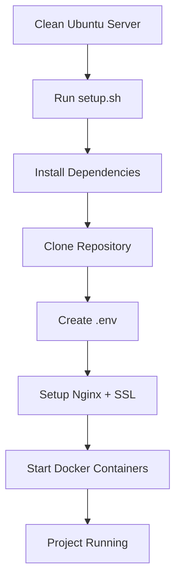
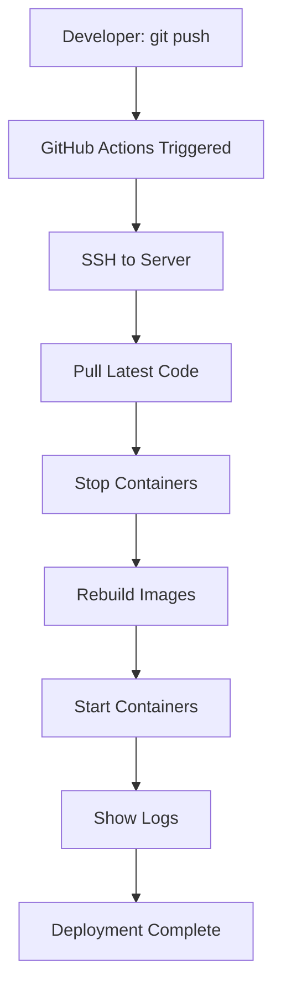

# 🔧 TECHNICAL SUMMARY - Deployment Automation

## Overview

Complete deployment automation system for **Bot DB Charm** project with CI/CD, Docker, and SSL.

---

## Architecture

```
┌─────────────────────────────────────────────────┐
│              GitHub Repository                   │
│  ┌──────────────────────────────────────────┐  │
│  │    git push → GitHub Actions Trigger     │  │
│  └──────────────────┬───────────────────────┘  │
└─────────────────────┼──────────────────────────┘
                      │
                      ▼
┌─────────────────────────────────────────────────┐
│           GitHub Actions Workflow                │
│  ┌──────────────────────────────────────────┐  │
│  │  1. SSH to server                        │  │
│  │  2. git pull                             │  │
│  │  3. docker-compose down                  │  │
│  │  4. docker-compose up -d --build         │  │
│  │  5. Show logs                            │  │
│  └──────────────────────────────────────────┘  │
└─────────────────────┬───────────────────────────┘
                      │
                      ▼
┌─────────────────────────────────────────────────┐
│              Ubuntu Server                       │
│                                                  │
│  ┌────────────┐  ┌────────────┐  ┌───────────┐ │
│  │  Nginx     │  │  Docker    │  │  Certbot  │ │
│  │  + SSL     │  │  Compose   │  │  SSL Auto │ │
│  └──────┬─────┘  └─────┬──────┘  └───────────┘ │
│         │              │                         │
│         │         ┌────┴─────┐                  │
│         │         │          │                   │
│    ┌────▼────┐  ┌─▼────┐  ┌─▼─────┐            │
│    │ Port 80 │  │ Bot  │  │Backend│            │
│    │ Port443 │  │Python│  │Node.js│            │
│    └────┬────┘  └──┬───┘  └───┬───┘            │
│         │          │          │                  │
│         │          └──────┬───┘                  │
│         │                 │                      │
│         │           ┌─────▼─────┐               │
│         └──────────►│PostgreSQL │               │
│                     │   (DB)    │               │
│                     └───────────┘               │
└─────────────────────────────────────────────────┘
```

---

## Components

### 1. Docker Services

**docker-compose.yml:**
```yaml
services:
  postgres:    # PostgreSQL 15 (database)
  backend:     # Node.js 18 (API)
  bot:         # Python 3.11 (Telegram bot)
```

**Features:**
- Healthchecks for postgres
- Automatic restart on failure
- Shared network (keystone_network)
- Volume persistence for database
- Environment variables from .env

### 2. Setup Script (deploy/setup.sh)

**Installs:**
- Docker & Docker Compose
- Node.js 18 (via NodeSource)
- Python 3.11 (via deadsnakes PPA)
- Nginx
- Certbot (Let's Encrypt)

**Configures:**
- Clones repository to ~/keystone_project
- Creates .env from .env.example
- Sets up Nginx with SSL
- Configures auto-renewal for SSL (cron)
- Starts all Docker containers

**Usage:**
```bash
./deploy/setup.sh
```

### 3. GitHub Actions (.github/workflows/deploy.yml)

**Triggers:**
- Push to main or master branch

**Steps:**
1. Checkout code (not used, server pulls directly)
2. SSH to server using secrets:
   - SERVER_IP
   - SERVER_USER
   - SERVER_SSH_KEY
   - SERVER_PORT
3. Execute deployment script:
   - cd ~/keystone_project
   - git reset --hard origin/main
   - docker-compose down
   - docker image prune -f
   - docker-compose up -d --build
   - Show logs

**Required Secrets:**
```
SERVER_IP=123.45.67.89
SERVER_USER=root
SERVER_SSH_KEY=<private_key_content>
SERVER_PORT=22
```

### 4. Nginx Configuration

**Auto-generated by setup.sh:**

```nginx
# HTTP → HTTPS redirect
server {
    listen 80;
    server_name domain.com www.domain.com;
    return 301 https://$server_name$request_uri;
}

# HTTPS
server {
    listen 443 ssl http2;
    server_name domain.com www.domain.com;
    
    ssl_certificate /etc/letsencrypt/live/domain.com/fullchain.pem;
    ssl_certificate_key /etc/letsencrypt/live/domain.com/privkey.pem;
    
    location / {
        proxy_pass http://localhost:3000;
        # ... proxy settings
    }
    
    location /api/ {
        proxy_pass http://localhost:3000;
        # ... proxy settings
    }
}
```

### 5. SSL Auto-Renewal

**Cron job created by setup.sh:**
```cron
0 3 * * * root certbot renew --quiet --post-hook 'systemctl reload nginx'
```

Runs daily at 3:00 AM, renews certificates if needed, reloads Nginx.

---

## Environment Variables

**Required in .env:**

```env
# Database
DB_HOST=postgres
DB_PORT=5432
DB_NAME=keystone
DB_USER=postgres
DB_PASSWORD=<secure_password>

# Backend
NODE_ENV=production
PORT=3000
JWT_SECRET=<random_string>
API_BASE_URL=http://localhost:3000/api

# Telegram Bot
TELEGRAM_BOT_TOKEN=<bot_token>
BOT_TOKEN=<bot_token>
BOT_USERNAME=<bot_username>

# Admin
ADMIN_ID=<telegram_user_id>
ADMIN_IDS=<comma_separated_ids>

# Optional
LOG_LEVEL=INFO
DOMAIN=example.com
SSL_EMAIL=admin@example.com
```

**Generate secure secrets:**
```bash
./deploy/generate-secrets.sh
```

---

## Deployment Flow

### Initial Deployment:



### Continuous Deployment:



---

## File Structure

```
project/
├── .github/workflows/
│   └── deploy.yml                 # CI/CD workflow
│
├── deploy/
│   ├── setup.sh                  # Main setup script
│   ├── quick-update.sh           # Quick update script
│   ├── generate-secrets.sh       # Secret generator
│   └── README.md                 # Scripts documentation
│
├── telegram_bot/                 # Python bot code
├── config/                       # Backend config
├── controllers/                  # Backend controllers
├── routes/                       # Backend routes
├── services/                     # Backend services
│
├── .env.example                  # Environment template
├── .gitignore                    # Git ignore rules
├── docker-compose.yml            # Docker orchestration
├── Dockerfile.backend            # Backend image
├── Dockerfile.bot                # Bot image
│
└── Documentation/
    ├── START_HERE.md            # Entry point
    ├── DEPLOY_README.md         # Deploy navigation
    ├── QUICK_DEPLOY.md          # Quick start
    ├── DEPLOY_FULL_GUIDE.md    # Complete guide
    ├── GITHUB_ACTIONS_SETUP.md # CI/CD setup
    └── DEPLOY_FAQ.md            # FAQ
```

---

## Security Considerations

### 1. Environment Variables
- Never commit .env to repository
- Use strong passwords (generate-secrets.sh)
- Rotate JWT_SECRET regularly

### 2. SSH Keys
- Use dedicated deploy keys
- Restrict key permissions (chmod 600)
- Add to .gitignore

### 3. Docker
- Use official images only
- Keep images updated
- Don't expose unnecessary ports

### 4. Nginx
- HTTPS only (HTTP redirects to HTTPS)
- Strong SSL protocols (TLSv1.2, TLSv1.3)
- Proxy headers for backend

### 5. Firewall (UFW)
```bash
sudo ufw allow 22/tcp    # SSH
sudo ufw allow 80/tcp    # HTTP
sudo ufw allow 443/tcp   # HTTPS
sudo ufw enable
```

---

## Monitoring & Logging

### Docker Logs:
```bash
docker-compose logs -f            # All services
docker-compose logs -f bot        # Bot only
docker-compose logs -f backend    # Backend only
docker-compose logs -f postgres   # Database only
```

### Nginx Logs:
```bash
sudo tail -f /var/log/nginx/access.log
sudo tail -f /var/log/nginx/error.log
```

### System Logs:
```bash
journalctl -xe                    # System journal
journalctl -u nginx               # Nginx unit
```

---

## Troubleshooting

### Container won't start:
```bash
docker-compose logs container_name
docker-compose up -d --force-recreate container_name
```

### GitHub Actions fails:
1. Check secrets are set correctly
2. Verify SSH key is added to server
3. Check server is reachable
4. Review workflow logs in GitHub

### SSL certificate issues:
```bash
sudo certbot certificates         # Check status
sudo certbot renew --dry-run      # Test renewal
sudo nginx -t                     # Test nginx config
```

### Database connection issues:
```bash
docker-compose exec postgres psql -U postgres -d keystone
# Check if database is accessible
```

---

## Performance Optimization

### 1. Docker Images
- Use Alpine Linux (smaller images)
- Multi-stage builds
- .dockerignore for unused files

### 2. Nginx
- Enable gzip compression
- Cache static files
- Connection pooling

### 3. PostgreSQL
- Tune shared_buffers
- Configure connection pooling
- Regular VACUUM operations

### 4. Node.js
- Use production mode
- Enable clustering
- Minimize dependencies

---

## Backup Strategy

### Database Backup:
```bash
# Manual backup
docker-compose exec -T postgres pg_dump -U postgres keystone > backup.sql

# Restore
cat backup.sql | docker-compose exec -T postgres psql -U postgres keystone

# Automated (cron)
0 2 * * * cd ~/keystone_project && docker-compose exec -T postgres pg_dump -U postgres keystone > /backups/db_$(date +\%Y\%m\%d).sql
```

### Code Backup:
- GitHub serves as primary backup
- Server snapshots recommended
- .env file backup (secure location)

---

## Scaling Considerations

### Horizontal Scaling:
1. Add load balancer (Nginx)
2. Multiple backend instances
3. Shared PostgreSQL
4. Redis for sessions

### Vertical Scaling:
1. Increase server resources
2. Optimize database queries
3. Add caching layer
4. CDN for static files

---

## Maintenance Tasks

### Daily:
- [x] Monitor logs for errors
- [x] Check container health
- [x] Verify SSL certificate validity

### Weekly:
- [x] Review disk space usage
- [x] Check backup integrity
- [x] Update dependencies

### Monthly:
- [x] Security updates (apt upgrade)
- [x] Docker image updates
- [x] Performance review
- [x] Database optimization (VACUUM)

---

## Quick Reference Commands

```bash
# Deployment
./deploy/setup.sh              # Initial setup
./deploy/quick-update.sh       # Quick update
./deploy/generate-secrets.sh   # Generate secrets

# Docker
docker-compose up -d           # Start all
docker-compose down            # Stop all
docker-compose restart         # Restart all
docker-compose logs -f         # View logs
docker-compose ps              # Status

# Nginx
sudo nginx -t                  # Test config
sudo systemctl reload nginx    # Reload
sudo systemctl restart nginx   # Restart

# SSL
sudo certbot certificates      # Check status
sudo certbot renew             # Renew

# System
htop                          # Process monitor
df -h                         # Disk usage
free -h                       # Memory usage
```

---

## Support

- **Documentation:** See DEPLOY_README.md
- **FAQ:** See DEPLOY_FAQ.md
- **Issues:** GitHub Issues
- **PRs:** Welcome!

---

**Last Updated:** 2024-01-20  
**Version:** 1.0.0  
**Author:** Deployment Team
